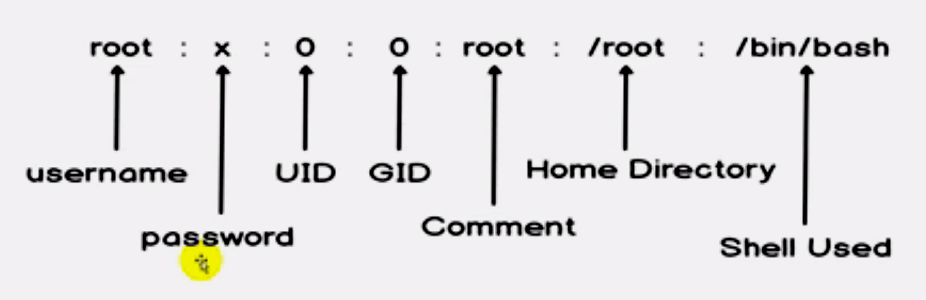
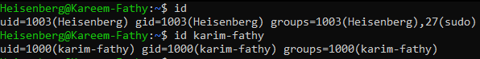
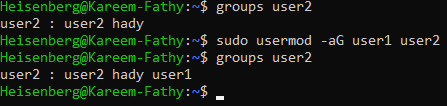

# Users
> ``/etc/passwd/`` # contains the database of all users

> ``man 5 passwd`` #	the man pages of passwd file

## Content of `passwd` file:
- each line has 7 fields
> 
> 
 
## 1- Super User (root)
- UID = 0

## 2- System User
- UID = 1:199
- can not login at system
- only for system apps

## 3- Service User
- UID = 200: 999

## 4- Regular User
- UID = +1000 
- any created user will create a primary group and will be member of it
- Secondary groups also can be created.

>```id```           
>``id <user>`` # show info about the current user or the given user

> 


# `How to add users?!`
- ### useradd command and some options
- `useradd <options> username`
   - -m    # create a home directory under `/home/`
	- -d 	  #spicify the home directory path
   - -p    # create a `nonencrypted` password
   - -s    # select a shell
   - -c    # add comment
   - -u    # spicify the user id
	- -g	  # spicify the primary group id 
## Example:
> ## ``sudo useradd -m -p PasSw0rD -s /bin/bash -c "add user 1" -u 1011 user1``
> 
> 

## interactive adding user 
> ## ``adduser <username>``
>  

## IN REDHAT ⛑
> ## Redhat create the home directory and selech bash shell as the default shell by default
> ``useradd username``


# `How to modify users?!`
- ### usermod command and some options
- `usermod <options> user` 
	- -u username 							# modify the user ID
	- -g	new_primary_group user		# change the primary group
	- -G 	group user						# add the user to secondary group, delete/exit from the other groups
	- 
	- -aG groups user						# append to secondary groups
	- -rG group user						# remove a user from a group
	- 
	- -L user								# lock user [!password in shadow file]
	- -U user								# unlock 	
	- -s [shell path]						# edit the user shell

- `gpasswd -d user group`	   # to remove a user from a group
- `passwd <user>`		# to add an encrypted password
- 
- `groups <user>`		# to display the groups that  the user is member in


# `How to remove a user?!`
- ### userdel command to remove the user
- `userdel <options> user`
	- -r					# to completely remove the user and its home directory
- `userdel user`		# remove only the user from `passwd` file

------------------------------------------------------------------

# Groups
> `cat /etc/group` # display all groups and its members, primary groups will not be printed.
- 

### Content of `group` file:
- each line has 4 fields
- 


# `Hwo to create a group?!`
- `groupadd <option> group`
	- -g 		# assign a group id
- `usermod -aG group user` #adding a user to group 