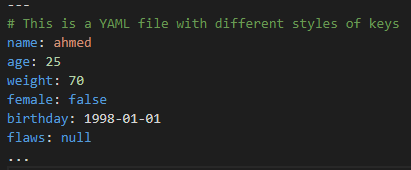
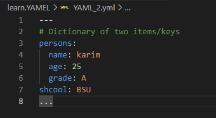
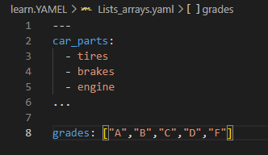
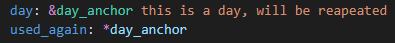
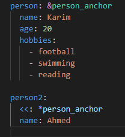
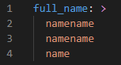
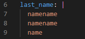
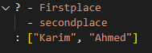
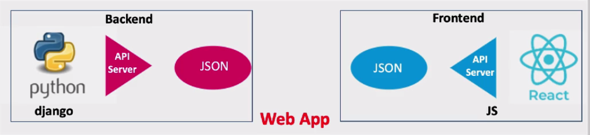

# The three primitive/basic data structure 

- Scaler (string, numbers, Boolen)
- Mapping [Hashes or Dictionaries]
- Sequences [Arrays, List] 

----------------------------------

## Comments
    # This is a comment

## Start and End of Document
    ---
        Document
    ...
   - Markers For each Document
   - The streem/YAML file can has more than Document  

## YAML tools:

> ``https://onlineyamltools.com/validate-yaml``
> ``http://jsonformatter.org/yaml-viewer``

-----------
# [1] YAMEL Data Structure [Key/Value pairs]
   - > ``key: value``   # Key/value pair 
        - space must be spisified after colon ":" 
        - the kay may be one or more words separted by spase, dash or underscore  
        - they are not the same 

        * In YAML, 'key': 'pair' is not equal to key: pair.
        * 'key': 'pair' treats both the key and value as strings with explicit quotes.
        * key: pair treats the key as a plain scalar and the value as a plain scalar without quotes.
### Example:

# [2] YAMEL Data Structure [Dictionaries / Mappings / Hashes]

   - list of items with indented space
   - mappings means assign pairs to a key
     - parent & childs
   - {} ->  means dictionary of items
   - Dictionary may be only one key pair or more 

        

# [3] YAMEL Data Structure [Listst / Arrays / Sequences]
    - list of items with indentation 
### Example
 

# Advanced YAML Features:
- Aliases/Anchor:
   - make aliases for values to use it anywhere
	   * 
	- make anchor for the whole dictonary:
		* 
- Multi line String (> , | , ?): 
   - key: > 
      
   - key: |  
      * adding a line feed '\n' after each line 
      * kep the formating correct
      * 
   - ? key:
      * for multi-line key
      * 	
	

# Application Programming Interface [API]

